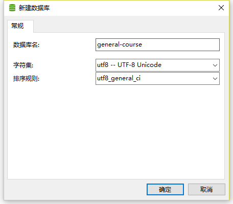
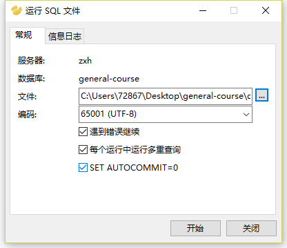

# 数据库设计
## 数据库表设计
1. 栏目(colunm (column为sql关键字无法使用))
- id				栏目ID
- name      		栏目名称
- level				栏目的级别	(0为父栏目，1为子栏目， 只有两级栏目， 默认为0)
- parentId			上级栏目的ID (没有则为0，默认为0)

2. 文章(article)
- id				文章的ID
- title     		文章的标题
- employeeId		文章的作者的ID，对应一个人员
- columnId			栏目id
- content			文章的内容
- createTime		创建日期
- whetherTop		是否置顶(0:不置顶 1:置顶)
- status			文章状态(0:未审核 1: 审核通过 2:审核不通过)

3. 角色(role)
- id				角色ID
- name				角色名称						
- createTime		创建时间
- description		描述角色

4. 权限(permission) 仅用于记录角色表和模块的连接
- id				权限ID
- roleId			角色ID
- moduleId			模块的ID

5. 父模块(module)
- id				模块ID
- name				模块名称
- status			模块状态(0:禁用 1:启用)

6. 子模块(subModule)
- id				模块ID
- name				模块名称
- status			模块状态(0:禁用 1:启用)
- parentModuleID	父类模块ID

7. 人员(employee)
- id				员工ID
- name				员工姓名
- sex				员工性别(0:未知 1男性 2：女性)
- account 			员工账号
- passWord			员工密码
- roleID			角色ID

8. 留言(message)
- id				留言ID
- content			留言内容
- createTime		留言时间
- reply				回复内容
- employeeId		回复人员ID
- replyTime			回复时间			
- status			回复状态(0:未回复 1:已回复)
- moduleId			留言模块的ID

9. 教育资源(file)
- id				教育资源ID
- articleId			与文章管理相关联
- path   			存放的路径

## 创建数据库
1. 推荐使用navicat手动创建

1. 使用命令行代码创建
~~~
CREATE DATABASE general-course;
use general-course;
~~~

## 运行SQL文件创建表及导入数据

- 使用navicat

## 所有操作完成后的结果应是下面的
- 共有五个表有数据，分别是colunm, module, permission, role, subModule
- 具体细节可查看result截图